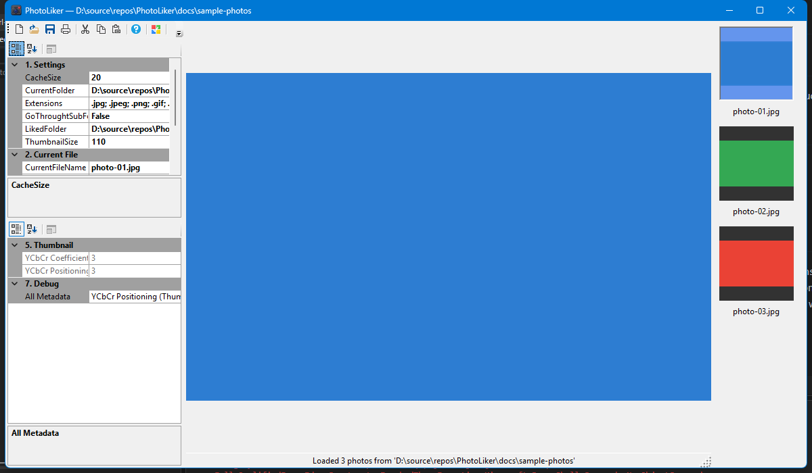
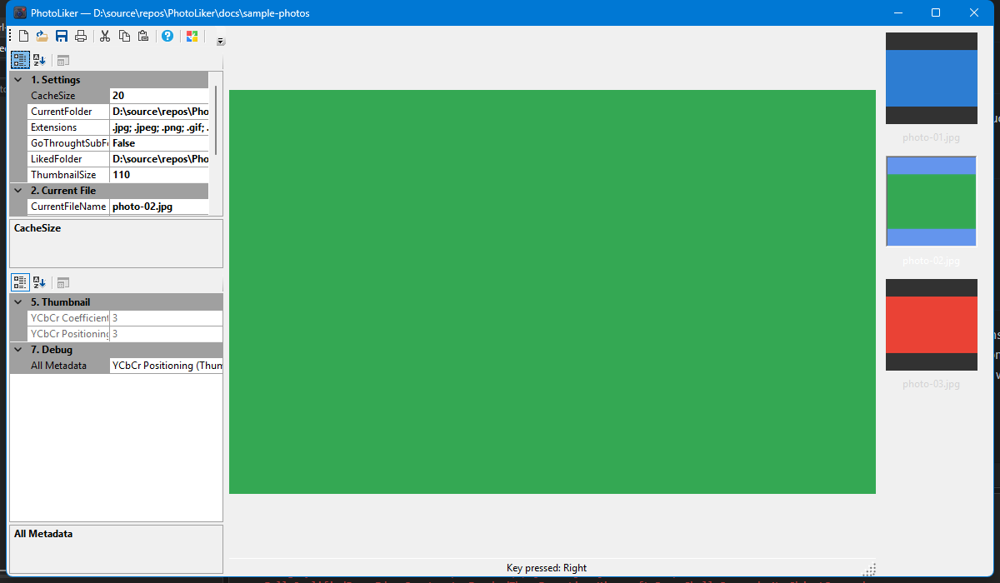
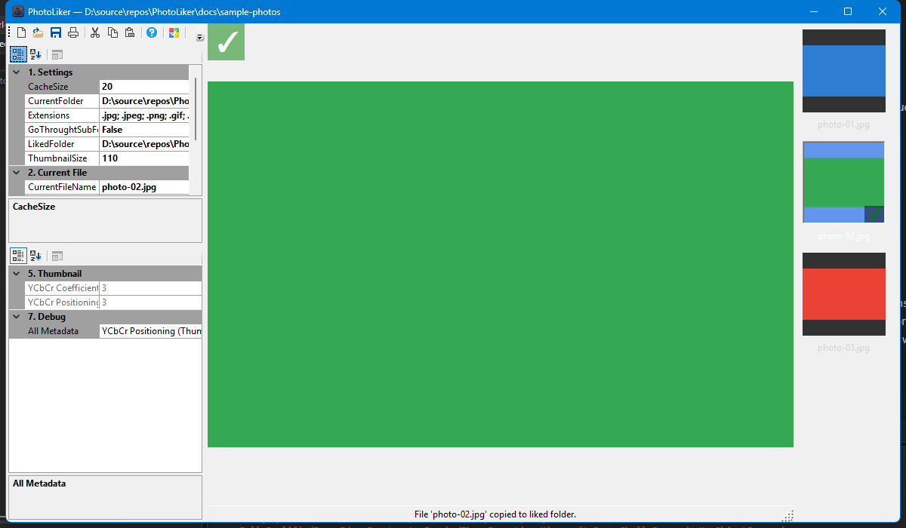
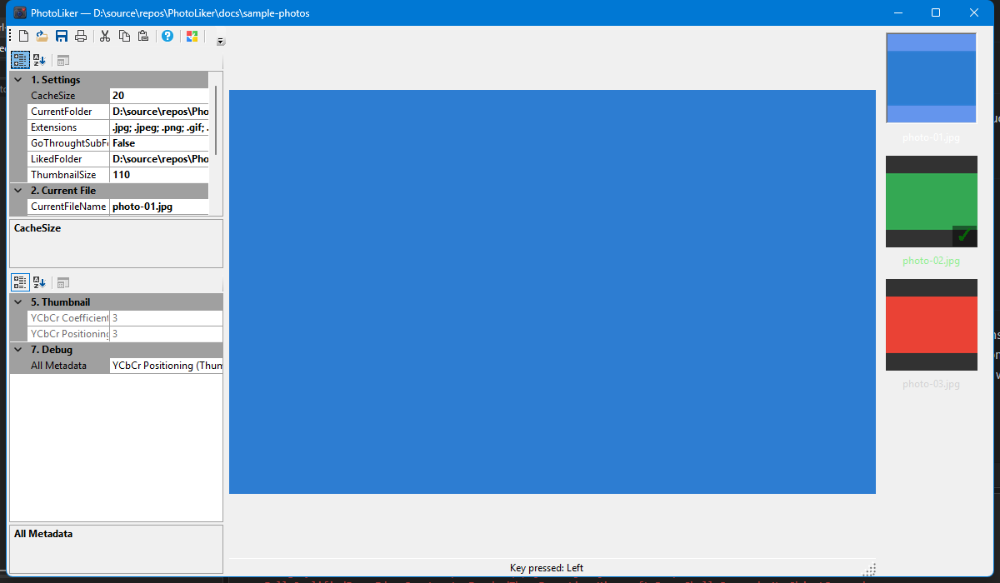

# PhotoLiker

PhotoLiker is a Windows desktop photo triage tool for quickly browsing images and marking favorites.

## Happy path walkthrough

The screenshots below were captured from a common flow using a sample folder with photos:

1. Launch the app with a photo folder loaded.
2. Browse to the next image using the **Right Arrow** key.
3. Toggle like/unlike for the current image using the **Space** key.
4. Move back using the **Left Arrow** key.
5. Fit the image to the viewer using the **O** key.

### 1) Home view (folder loaded)

### 2) Next photo

### 3) Liked photo toggled

### 4) Previous photo

### 5) Fit image to viewer

## Keyboard shortcuts used in this flow

- `Right Arrow`: Next photo
- `Left Arrow`: Previous photo
- `Space`: Toggle like/unlike
- `O`: Fit image to viewer
